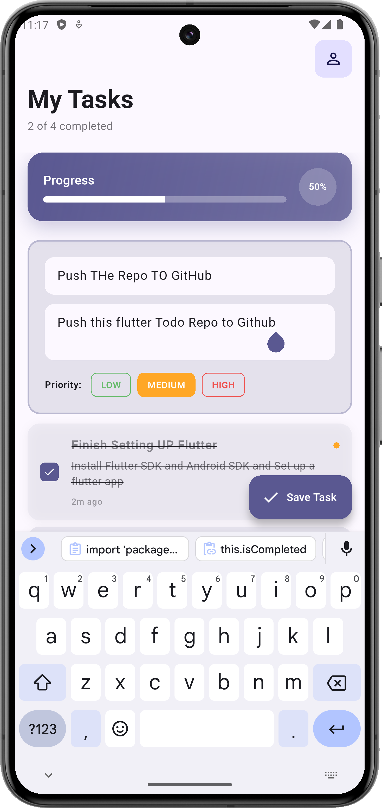
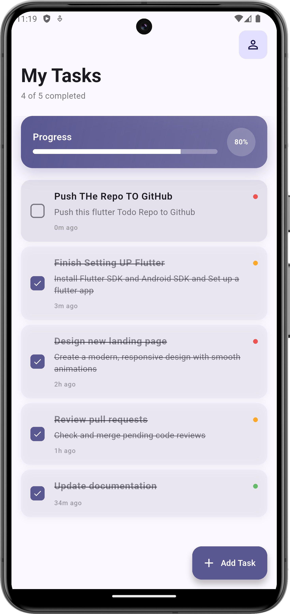

# Stunning Todo App

A beautiful todo application built with Flutter featuring modern Material 3 design, smooth animations, and intuitive task management.

## Features

- ✅ Add, complete, and delete tasks
- 🎨 Modern Material 3 design with dark/light theme
- 📊 Visual progress tracking
- 🏷️ Priority levels (High, Medium, Low)
- 📱 Responsive design for all devices
- ✨ Smooth animations and haptic feedback

## Screenshots
&nbsp;&nbsp; 


## Getting Started

### Prerequisites
- Flutter SDK (3.0+)
- Dart SDK

### Installation

1. **Clone the repository:**
   ```bash
   git clone https://github.com/yourusername/stunning-todo-app.git
   ```

2. **Navigate to project directory:**
   ```bash
   cd stunning-todo-app
   ```

3. **Install dependencies:**
   ```bash
   flutter pub get
   ```

4. **Run the app:**
   ```bash
   flutter run
   ```

## How to Use

- **Add Task:** Tap the floating action button
- **Complete Task:** Tap the checkbox next to any task
- **Delete Task:** Swipe left on any task
- **Set Priority:** Choose priority level when adding tasks

## Tech Stack

- **Framework:** Flutter
- **Language:** Dart
- **Design:** Material 3
- **Platform:** iOS, Android, Web

## Contributing

1. Fork the repository
2. Create your feature branch (`git checkout -b feature/new-feature`)
3. Commit your changes (`git commit -m 'Add new feature'`)
4. Push to the branch (`git push origin feature/new-feature`)
5. Open a Pull Request

## License

This project is licensed under the MIT License.

---

⭐ Star this repo if you found it helpful!
